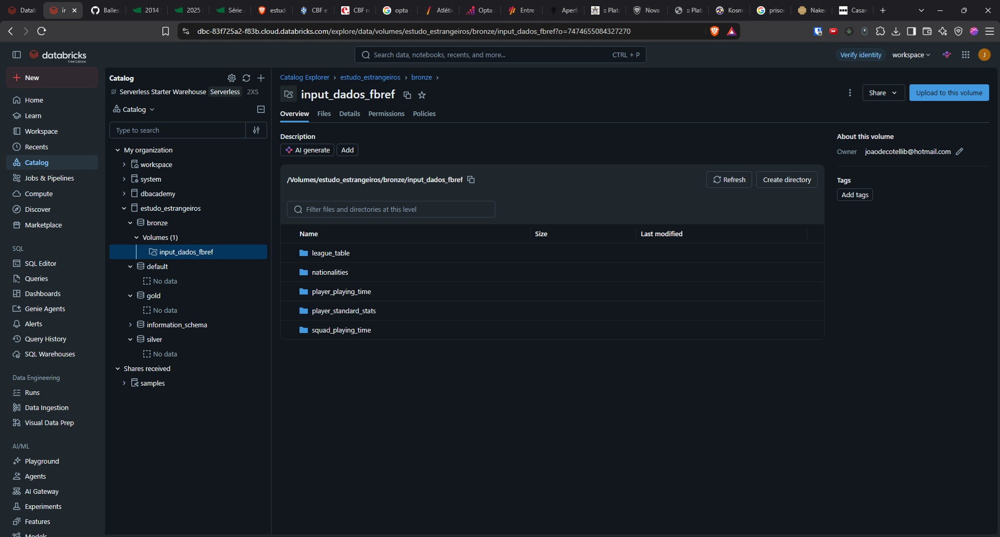
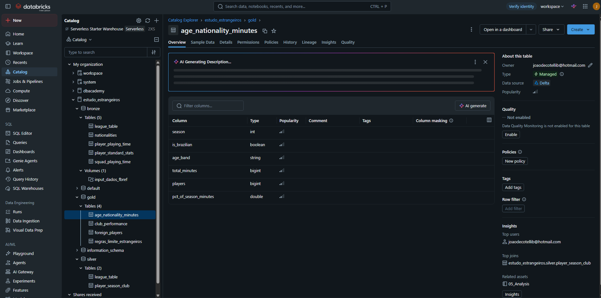
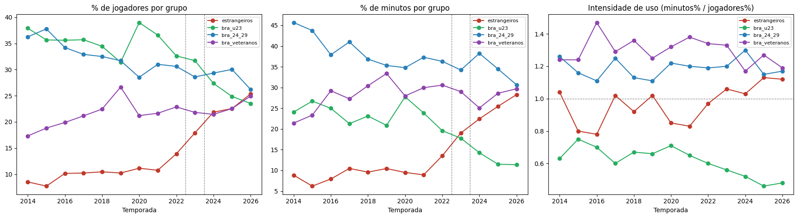
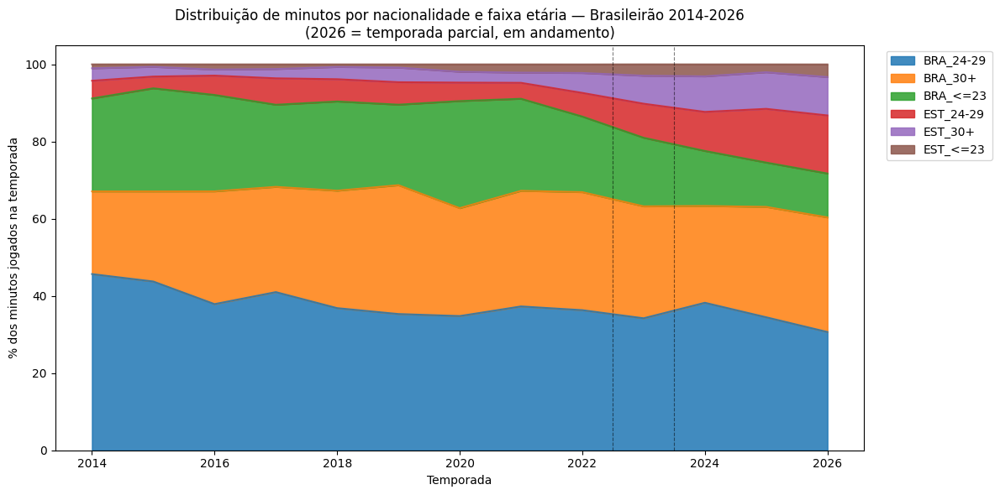
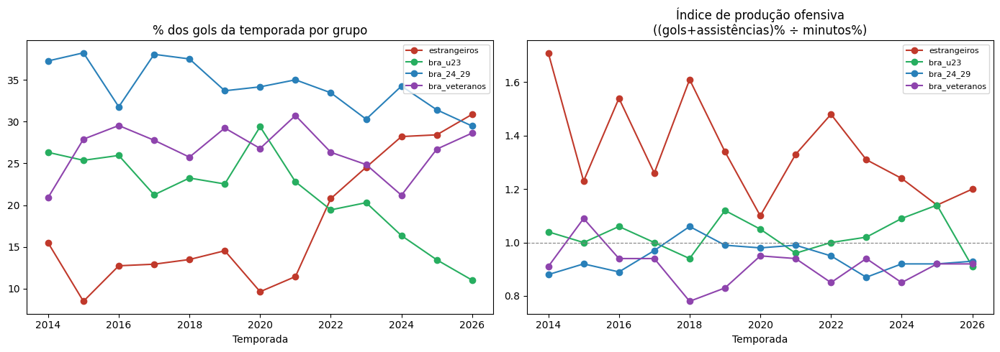
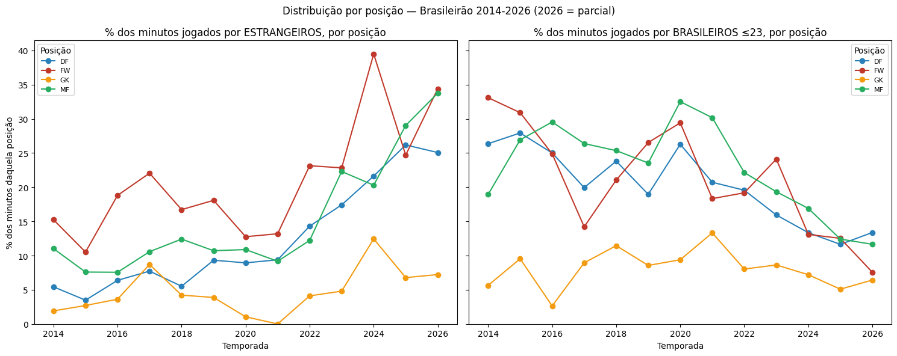

# Estrangeiros e Jovens Brasileiros no Campeonato Brasileiro — MVP de Engenharia de Dados

Pipeline de dados na nuvem (Databricks, arquitetura Bronze → Silver → Gold) construído para estudar a evolução da participação de jogadores estrangeiros e de brasileiros jovens (sub-23) no Campeonato Brasileiro, entre 2014 e 2026.

## Estrutura do Repositório

```
Estudo-estrangeiros/
├── notebooks/
│   ├── 01_bronze_ingestion.ipynb   # Ingestão dos CSVs do FBref -> tabelas Bronze
│   ├── 02_silver_transform.ipynb   # Limpeza, tipagem e modelagem -> tabelas Silver
│   ├── 03_data_quality.ipynb       # Checagens de qualidade sobre a Silver
│   ├── 04_gold_tables.ipynb        # Agregações -> tabelas Gold
│   └── 05_Analysis.ipynb           # Respostas às perguntas de negócio
├── docs/
│   ├── catalogo_dados.md           # Catálogo de dados (Silver e Gold)
│   ├── decisoes_metodologicas.md   # Decisões de modelagem e seu racional
│   └── images/                     # Gráficos e evidências usados neste README
├── .gitignore
└── README.md
```

Os dados brutos (`data/`) não são versionados neste repositório — ver justificativa na seção **Carga dos Dados**.

---

## Contexto de Negócio e Perguntas (Etapa 2 e 4.1)

### Motivação

A CBF publicou um estudo apontando queda na participação de jogadores brasileiros sub-23 nas partidas do Brasileirão e aumento da presença de estrangeiros, especialmente acima de 23 anos. A partir disso, foi proposta e aceita a redução do limite de estrangeiros para os próximos anos. Este projeto não busca reproduzir os números da CBF, e sim construir uma análise própria, a partir de dados públicos do FBref, para verificar se esse padrão aparece nos dados e como ele se decompõe.

Também é contexto relevante a mudança regulatória no limite de estrangeiros relacionados por partida nas competições nacionais: 5 (2014–2022), 7 (2023) e 9 (2024 em diante), com nova redução anunciada para 2027 (fora do escopo temporal deste MVP).

### Pergunta central

Como as mudanças na composição etária e na presença de estrangeiros se relacionaram com a utilização de jogadores brasileiros jovens no Campeonato Brasileiro entre 2014 e 2026?

### Perguntas de negócio

1. Como evoluiu a participação de jogadores estrangeiros no Brasileirão (nº de jogadores, % de jogadores e, principalmente, % dos minutos jogados)?
2. Como evoluiu a participação de jogadores brasileiros ≤23 anos, em % dos minutos jogados, ao longo das temporadas?
3. Se a participação de brasileiros jovens caiu, para quem foram esses minutos? (matriz nacionalidade × faixa etária × % de minutos)
4. Existe relação entre uso de estrangeiros/jovens e desempenho do clube (posição, pontos por jogo, saldo de gols)? *(associação, não causalidade)*
5. A produção ofensiva (gols e assistências) acompanhou a redistribuição dos minutos entre estrangeiros e as faixas etárias brasileiras — ou algum grupo produz acima/abaixo do seu tempo em campo?
6. Como a utilização de estrangeiros e brasileiros ≤23 anos  varia por posição em campo?

### Período

2014–2025: temporadas completas e 2026 como temporada parical/em andamento.

### Fontes e licença

Dados públicos do FBref/Sports Reference (Campeonato Brasileiro Série A): `Player Standard Stats`, `Player Playing Time`, `Squad Playing Time`, `Nationalities` e `League Table`. Uso pessoal/acadêmico com atribuição obrigatória ("please cite us and provide a link and/or a mention"); os termos de uso do FBref não autorizam redistribuição em massa dos dados coletados — ver **Carga dos Dados**.

---

## Carga dos Dados (Etapa 4.2)

A coleta foi feita **manualmente**, tabela por tabela e temporada por temporada, via exportação nativa (CSV) disponibilizada pelo próprio FBref. Essa abordagem foi escolhida em vez de scraping automatizado porque o FBref adota política de limitação de requisições por minuto e bloqueio de acesso automatizado; contornar essas proteções violaria os termos de uso da fonte.

Os arquivos brutos foram enviados manualmente (upload) para um **Volume do Databricks** (Unity Catalog, `estudo_estrangeiros.bronze.input_dados_fbref`), organizado em uma subpasta por tabela, com um arquivo `<temporada>.csv` por ano.

**Sobre a licença e o repositório público**: como o FBref não autoriza redistribuição em massa dos dados, os arquivos brutos (`data/`) não são versionados neste repositório — apenas o código (notebooks, documentação, catálogo de dados). Os dados residem só no Volume do Databricks, fora do controle de versão.

Notebook de referência: [`notebooks/01_bronze_ingestion.ipynb`](notebooks/01_bronze_ingestion.ipynb).



---

## Modelagem e Catálogo de Dados (Etapa 4.3)

### Arquitetura Medalhão

- **Bronze**: dados praticamente brutos (schema achatado, tipagem mínima), com metadados de controle (`_season`, `_source_table`, `_source_file`, `_ingested_at`) para rastreabilidade. Implementada como schema `estudo_estrangeiros.bronze` no Unity Catalog, uma tabela Delta por fonte do FBref.
- **Silver**: dados limpos, tipados e integrados, na granularidade **jogador-temporada-clube** (preserva jogadores transferidos no meio da temporada). Schema `estudo_estrangeiros.silver`.
- **Gold**: tabelas agregadas, uma por bloco de perguntas de negócio. Schema `estudo_estrangeiros.gold`.

### Catálogo de dados

Documentação completa de cada tabela/coluna (tipo, descrição, domínio) em [`docs/catalogo_dados.md`](docs/catalogo_dados.md).

As decisões de modelagem tomadas ao longo da construção do pipeline — incluindo o cálculo de idade por geração, a separação de posição primária e secundária, os cortes de faixa etária e o tratamento de nomes de coluna — estão registradas com o respectivo racional em [`docs/decisoes_metodologicas.md`](docs/decisoes_metodologicas.md).



---

## Pipeline de Dados (Etapa 4.4)

O pipeline é organizado em **5 notebooks**, um por etapa, desenvolvidos no Databricks e versionados neste repositório em `notebooks/`:

| Notebook | Função |
|---|---|
| [`01_bronze_ingestion`](notebooks/01_bronze_ingestion.ipynb) | Lê os CSVs do Volume, detecta automaticamente a linha de cabeçalho (o export do FBref tem preâmbulo de citação + linha de categoria antes do cabeçalho real), remove linha de rodapé de citação, adiciona metadados de ingestão e grava como tabela Delta Bronze — uma célula por tabela de origem, um loop interno por temporada (2014-2026). |
| [`02_silver_transform`](notebooks/02_silver_transform.ipynb) | Tipagem tolerante (`try_cast`, necessária pela heterogeneidade de formato entre temporadas completas e a temporada em andamento), extração de código de nacionalidade e posição primária/secundária, cálculo de idade por geração e faixa etária, garantia da granularidade jogador-temporada-clube. |
| [`03_data_quality`](notebooks/03_data_quality.ipynb) | Checagens de completude, unicidade, consistência/acurácia e outliers sobre a Silver, além da validação cruzada contra os agregados publicados pela fonte. |
| [`04_gold_tables`](notebooks/04_gold_tables.ipynb) | Agregações: `age_nationality_minutes`, `foreign_players`, `club_performance` e a tabela de referência `regras_limite_estrangeiros`. |
| [`05_Analysis`](notebooks/05_Analysis.ipynb) | Consultas e visualizações respondendo às 6 perguntas de negócio. |

Os notebooks estão versionados em formato `.ipynb`, que o GitHub renderiza com as saídas preservadas — tabelas e gráficos podem ser inspecionados diretamente pelo navegador, sem necessidade de executar o pipeline.

Evidência das tabelas persistidas nas três camadas, no Unity Catalog:


---

## Qualidade de Dados (Etapa 4.5)

A verificação foi executada no notebook `03_data_quality`, sobre a tabela Silver `player_season_club`, cobrindo cinco dimensões: **completude** (proporção de nulos por coluna), **unicidade** (duplicidade na granularidade definida), **consistência** (valores no formato esperado), **acurácia** (valores plausíveis no contexto do futebol) e **outliers** (extremos capazes de distorcer agregações).

Cinco problemas foram identificados ao longo da construção do pipeline. Todos foram tratados na camada em que se originam — problemas de estrutura do arquivo na Bronze, problemas de interpretação do valor na Silver.

**1. Cabeçalho precedido de linhas decorativas.** O arquivo exportado pelo FBref não começa pela linha de cabeçalho: antes dela vêm uma linha de citação da fonte (`--- When using SR data...`), linhas em branco e uma linha de "categoria" que agrupa colunas visualmente (`,,,Playing Time,,,`). A quantidade dessas linhas variava entre tabelas e entre temporadas. Uma leitura ingênua tomaria a primeira linha do arquivo como cabeçalho e corromperia todas as colunas. A solução, na Bronze, foi detectar dinamicamente o cabeçalho como a primeira linha totalmente preenchida — critério que funciona independentemente de quantas linhas de lixo a precedam.

**2. Linha de rodapé capturada como se fosse dado.** Alguns arquivos trazem ao final uma linha de atribuição (`Provided by FBref.com...`). Ela era lida como se fosse um jogador, gerando um registro com praticamente todos os campos nulos e, nas tabelas com colunas numéricas, quebrando a conversão de tipos. Resolvido na Bronze com um filtro que descarta qualquer linha contendo essa assinatura.

**3. Formatos numéricos heterogêneos entre temporadas.** A coluna de idade vem como inteiro (`"25"`) nas temporadas encerradas, mas como "anos-dias" (`"27-166"`) na temporada em andamento, já que o FBref calcula a idade até a data corrente enquanto a competição não termina. Somado a isso, colunas que continham nulos eram lidas como decimais (`"19.0"` em vez de `"19"`). Ambos os casos quebravam a conversão estrita de tipos. Resolvido na Silver com `try_cast` encadeado (texto → decimal → inteiro): tolera o formato decimal e devolve nulo, em vez de interromper o processamento, quando o valor não é numérico.

**4. Lacunas de nacionalidade e posição na fonte.** Três registros aparecem sem nacionalidade e dois sem posição. A investigação mostrou tratar-se de lacuna legítima do FBref, não de erro de leitura: o mesmo jogador (Artur, do Palmeiras) aparece sem nacionalidade em temporadas diferentes (2016 e 2018), o que indica cadastro incompleto na origem, e não falha pontual do pipeline. Como representam menos de 0,05% da base e mantêm informação válida nas demais colunas, os registros foram preservados. Nas agregações que dependem de nacionalidade eles formam naturalmente uma categoria própria, sem serem classificados incorretamente como brasileiros ou estrangeiros.

**5. Nomes de coluna incompatíveis com o formato de armazenamento.** Colunas como `# Pl`, `# Players` e `Top Team Scorer` contêm caracteres que o Delta Lake não aceita em identificadores. Foram sanitizadas na Bronze, substituindo esses caracteres por `_` — operação que altera apenas o nome da coluna, nunca o valor armazenado.

Após os tratamentos, as checagens finais retornaram: **nenhuma duplicidade** na granularidade jogador-temporada-clube; **nenhum registro fora das faixas plausíveis** (idade entre 14 e 46 anos, minutos entre 0 e 3.420, titularidades nunca superiores a partidas disputadas, gols e assistências não negativos); e **ausência de nulos nas colunas-chave**. A única coluna com proporção alta de nulos é `position_secondary` (~79%), o que é o comportamento esperado e correto — a maioria dos jogadores tem uma única posição registrada na fonte.

### Validação externa contra os agregados da própria fonte

As checagens acima são internas: verificam a consistência do dado dentro do pipeline. Para testar se o pipeline **reproduz corretamente a realidade da fonte**, os totais calculados a partir do nível de jogador foram confrontados com a tabela `nationalities`, em que o próprio FBref publica minutos e número de jogadores já agregados por nacionalidade. São dois caminhos independentes para o mesmo número — se divergirem, há erro de transformação em algum ponto da cadeia.

Comparando 250 combinações de temporada × nacionalidade:

- **Nenhuma divergência de minutos acima de 1%.**
- Apenas duas divergências diferentes de zero: Brasil em 2018 (871 minutos a mais no nosso cálculo) e em 2014 (275 a mais). Ambas têm explicação exata: a tabela `nationalities` registra, nessas mesmas temporadas, **871 minutos para a Malásia em 2018 e 275 em 2014** — minutos que não aparecem do nosso lado. Trata-se de um jogador com dupla nacionalidade que a tabela de estatísticas individuais classifica como brasileiro e a tabela de nacionalidades atribui à Malásia. É uma inconsistência interna da fonte, não do pipeline — e o fato de os valores fecharem na unidade confirma que nenhum minuto foi perdido ou duplicado nas transformações.
- **Doze combinações sem correspondência**, todas com a mesma assinatura: nacionalidades que a fonte lista com um ou dois jogadores registrados, mas com o campo de minutos vazio. São jogadores que constam do elenco e nunca entraram em campo — ausentes da nossa base por construção, já que o `player_standard_stats` só lista quem efetivamente jogou.

Esse último ponto explica também a diferença sistemática nas **contagens de jogadores**: para o Brasil em 2018, 641 no nosso cálculo contra 781 publicados. O padrão se confirma nos casos pequenos, onde é possível inspecionar linha a linha — Peru em 2019 tem 3 jogadores na nossa base contra 4 publicados, com exatamente os mesmos 2.612 minutos; Chile em 2022, 6 contra 7, com os mesmos 2.970 minutos. Sempre um jogador a mais do lado publicado, sempre zero minutos de diferença.

**Conclusão da validação**: o pipeline reproduz os agregados da fonte com precisão, e as únicas divergências encontradas são características documentadas da origem dos dados, não defeitos da transformação. Fica registrado como limitação conhecida que as contagens de jogadores deste estudo se referem a **jogadores utilizados**, não a jogadores registrados no elenco — distinção relevante ao comparar com estudos que contam atletas relacionados.

---

## Análise de Dados (Etapa 4.5)

A série cobre **2014 a 2026**. A temporada de 2026 estava em andamento no momento da análise e aparece marcada com asterisco nas tabelas, para que o leitor saiba que seus totais absolutos ainda crescerão até o fim do campeonato — os percentuais, por serem calculados dentro de cada temporada, permanecem comparáveis.

### 1. Estrangeiros: de opção de banco a titular regular
*(Pergunta de negócio 1)*

| Temporada | Nº jogadores estrangeiros | % jogadores | % minutos | Intensidade de uso |
|---|---|---|---|---|
| 2014 | 62 | 8,52% | 8,84% | 1,04 |
| 2015 | 55 | 7,72% | 6,20% | 0,80 |
| 2016 | 73 | 10,15% | 7,92% | 0,78 |
| 2017 | 73 | 10,22% | 10,46% | 1,02 |
| 2018 | 75 | 10,46% | 9,59% | 0,92 |
| 2019 | 71 | 10,23% | 10,44% | 1,02 |
| 2020 | 82 | 11,14% | 9,50% | 0,85 |
| 2021 | 77 | 10,75% | 8,91% | 0,83 |
| 2022 | 104 | 13,90% | 13,51% | 0,97 |
| 2023 | 132 | 17,89% | 19,01% | 1,06 |
| 2024 | 155 | 21,86% | 22,43% | 1,03 |
| 2025 | 166 | 22,55% | 25,44% | 1,13 |
| *2026\** | *180* | *25,35%* | *28,28%* | *1,12* |

*\* 2026: temporada parcial, exibida como referência do movimento em curso.*

*Intensidade de uso = (% minutos do grupo) / (% jogadores do grupo) = minutos médios por jogador do grupo, relativo à média da liga naquela temporada. `1,0` = uso na média da liga; acima de `1,0` = grupo usado como titular regular; abaixo = usado mais como opção de rotação.*

O número de jogadores estrangeiros mais que dobrou entre 2014 e 2025 (62 → 166), e sua participação nos minutos da liga quase triplicou (8,84% → 25,44%). A intensidade de uso, porém, não mostra uma transição linear e gradual: entre 2014 e 2021 ela oscila naturalmente entre 0,78 e 1,04 (1,04 em 2014, cai para 0,78 em 2016, volta a 1,02 em 2017 e em 2019) — variação normal de temporada a temporada, sem tendência clara de alta. A partir de 2022 o quadro muda: os valores passam a ficar consistentemente mais próximos de, ou acima de, 1,0, numa faixa mais estreita — 0,97 (2022), 1,06 (2023), 1,03 (2024), 1,13 (2025) — e o dado de 2026 (parcial), 1,12, mantém esse patamar em vez de recuar para a instabilidade de 2014-2021. Ou seja: mais do que um crescimento contínuo desde 2014, houve uma **consolidação recente (a partir de 2022/2023)** do estrangeiro como peça relevante do elenco — não apenas mais contratações pontuais preenchendo a cota mais alta, mas um padrão de uso cada vez mais parecido com o de titular regular.

Isso é consistente com o próprio diagnóstico da CBF ("participação de estrangeiros nos minutos disputados saltou de 5,5% em 2013 para 27,3%") — nosso pipeline, com fonte (FBref) e metodologia próprias, chega a 25,44% em 2025 e 28,27% em 2026 (parcial), mesma ordem de grandeza obtida de forma independente.

Vale um contraponto que exige duas fontes externas. O [estudo apresentado pela CBF aos clubes](https://www.cbf.com.br/a-cbf/noticias/por-dentro-cbf-noticias/a/cbf-e-clubes-aprovam-reducao-do-numero-de-jogadores-estrangeiros-e-novos-horarios-de-transmissao-no-futebol-brasileiro) mostra que as grandes ligas europeias concedem bem mais minutos a jovens que o Brasileirão — França 38%, Inglaterra 32%, Espanha 31%, Alemanha 28%, Itália 28%, contra 14% no Brasil — e usa essa comparação como referência de boa prática na formação. Só que essas mesmas ligas dependem proporcionalmente **muito mais** de estrangeiros do que o Brasileirão: segundo o [CIES Football Observatory](https://www.espn.com/soccer/story/_/id/37535294/premier-league-third-most-reliant-foreign-players-europe-study), a participação estrangeira nos minutos é de 64,7% na Premier League, 61% na Serie A, 51,5% na Bundesliga, 39% na La Liga e 37,3% na Ligue 1 — todas acima dos ~25-28% brasileiros.

Isso relativiza a comparação: parte do "espaço para jovens" nessas ligas pode vir de jovens **recrutados no exterior**, e não de formação doméstica. O cruzamento entre as duas dimensões (idade × nacionalidade) nessas ligas não aparece no material público da CBF, que apresenta cada indicador isoladamente — e é justamente esse cruzamento que este trabalho realiza para o caso brasileiro.



### 2. Sub-23 brasileiro: um duplo declínio
*(Pergunta de negócio 2)*

| Temporada | Nº jogadores sub-23 | % jogadores | % minutos | Intensidade de uso |
|---|---|---|---|---|
| 2014 | 276 | 37,91% | 24,07% | 0,63 |
| 2015 | 254 | 35,67% | 26,72% | 0,75 |
| 2016 | 256 | 35,61% | 24,98% | 0,70 |
| 2017 | 255 | 35,71% | 21,27% | 0,60 |
| 2018 | 247 | 34,45% | 23,12% | 0,67 |
| 2019 | 218 | 31,41% | 20,86% | 0,66 |
| 2020 | 287 | 38,99% | 27,75% | 0,71 |
| 2021 | 262 | 36,59% | 23,85% | 0,65 |
| 2022 | 244 | 32,62% | 19,58% | 0,60 |
| 2023 | 234 | 31,71% | 17,77% | 0,56 |
| 2024 | 194 | 27,36% | 14,26% | 0,52 |
| 2025 | 183 | 24,86% | 11,48% | 0,46 |
| *2026\** | *167* | *23,52%* | *11,37%* | *0,48* |

*\* 2026: temporada parcial, exibida como referência do movimento em curso.*

O sub-23 brasileiro sofre uma queda em **duas frentes simultâneas**, não uma só: (1) o número de jogadores utilizados cai de 276 para 183 (-34%), e (2) a intensidade de uso — o quanto os que ainda jogam são aproveitados, relativo à média da liga — cai de 0,63 para 0,46. Isso significa que a queda real de protagonismo é maior do que a simples queda no % de minutos sugere: não é só que há menos jovens no elenco, é que os poucos que restam são usados com ainda menos confiança do que em 2014.

Validação externa forte: a CBF reporta "sub-23 na Série A: 28,3% dos minutos em 2020, caindo para 11,5% em 2026". Nosso pipeline, construído de forma independente a partir do FBref, encontrou **27,75% (2020)** e **11,37% (2026)** — uma convergência muito próxima entre duas fontes e metodologias diferentes, o que reforça a confiabilidade do padrão identificado.


### 3. Para quem foram os minutos? Estrangeiros e veteranos brasileiros, lado a lado
*(Pergunta de negócio 3)*

| Temporada | BRA 24-29 | BRA 30+ | BRA ≤23 | EST 24-29 | EST 30+ | EST ≤23 |
|---|---|---|---|---|---|---|
| 2014 | 45,67% | 21,42% | 24,07% | 4,60% | 3,23% | 1,01% |
| 2015 | 43,75% | 23,33% | 26,72% | 3,04% | 2,53% | 0,64% |
| 2016 | 37,89% | 29,21% | 24,98% | 5,01% | 1,57% | 1,34% |
| 2017 | 41,00% | 27,27% | 21,27% | 6,85% | 2,41% | 1,20% |
| 2018 | 36,85% | 30,42% | 23,12% | 5,77% | 3,18% | 0,66% |
| 2019 | 35,32% | 33,38% | 20,86% | 5,82% | 3,80% | 0,82% |
| 2020 | 34,79% | 27,96% | 27,75% | 4,78% | 2,80% | 1,92% |
| 2021 | 37,29% | 29,95% | 23,85% | 4,13% | 2,64% | 2,14% |
| 2022 | 36,32% | 30,58% | 19,58% | 6,13% | 5,16% | 2,22% |
| 2023 | 34,22% | 29,00% | 17,77% | 8,82% | 7,25% | 2,95% |
| 2024 | 38,24% | 25,07% | 14,26% | 10,12% | 9,21% | 3,10% |
| 2025 | 34,48% | 28,60% | 11,48% | 13,92% | 9,48% | 2,04% |
| *2026\** | *30,66%* | *29,69%* | *11,37%* | *15,05%* | *9,94%* | *3,28%* |

*\* 2026: temporada parcial (em andamento no momento da análise).*

A resposta não é "os minutos foram só para um lado". Olhando 2014→2025: as duas faixas mais numerosas de estrangeiros cresceram de forma quase idêntica, ambas na casa de **~3x** (EST 24-29: 4,60% → 13,92%; EST 30+: 3,23% → 9,48%). A faixa de estrangeiros ≤23 cresce menos e com bem mais oscilação ano a ano (1,01% → 2,04%, mas passando por 0,64%, 2,22%, 2,95%, 3,10% no meio do caminho) — esperado, já que é o grupo com menor volume absoluto de jogadores.

Ao mesmo tempo, os brasileiros veteranos (BRA 30+) não perdem espaço — oscilam entre 21% e 33% a série toda, sem tendência de queda. Ou seja: o espaço perdido pelos sub-23 foi capturado por uma **combinação** de mais estrangeiros (predominantemente 24 anos ou mais) e manutenção do espaço dos brasileiros mais velhos — não por uma única causa isolada, e não especificamente por "estrangeiros jovens" substituindo brasileiros jovens, como um cenário alternativo poderia sugerir.

Esse é exatamente o cruzamento que os slides públicos da CBF não fazem: eles reportam separadamente "elenco mais velho" e "menos minutos para jovens", mas não decompõem para onde os minutos migraram — essa decomposição nacionalidade × faixa etária é a contribuição específica deste estudo em relação ao material público da CBF.



### 4. Uso de estrangeiros e de jovens × desempenho do clube: associação fraca — e nula para os jovens
*(Pergunta de negócio 4)*

Correlação entre as variáveis de composição do elenco e as de desempenho, calculada sobre todos os pares clube-temporada de 2014 a 2025:

| Par de variáveis | Correlação |
|---|---|
| *(controle)* Pontos por jogo × Colocação final | **-0,95** |
| *(controle)* Pontos por jogo × Saldo de gols | **0,95** |
| % minutos de estrangeiros × Pontos por jogo | 0,25 |
| % minutos de estrangeiros × Gols marcados | 0,29 |
| % minutos de estrangeiros × Colocação final | -0,24 |
| % minutos de brasileiros ≤23 × Pontos por jogo | -0,07 |
| % minutos de brasileiros ≤23 × Colocação final | 0,04 |
| % minutos de estrangeiros × % minutos de brasileiros ≤23 | -0,23 |

A correlação varia de **-1** (quando uma variável sobe, a outra sempre cai) a **+1** (sobem juntas), sendo **0** ausência de relação. As duas primeiras linhas são **controles**: relações que já sabíamos existir antes de calcular (mais pontos por jogo significa necessariamente colocação melhor — e colocação melhor é número menor, daí o sinal negativo). Elas servem de régua de leitura: neste conjunto de dados, **uma relação forte aparece como 0,95**.

Com essa régua, a resposta fica clara:

- **Usar mais estrangeiros tem associação positiva com desempenho, mas fraca** (0,25 a 0,29). A tendência existe e é consistente em todos os indicadores (mais pontos, mais gols, colocação melhor), mas está muito distante de ser determinante — não se prevê o desempenho de um clube a partir do quanto ele usa estrangeiros. Há ainda um candidato óbvio a variável de confusão: **orçamento**. Clubes com mais recursos contratam mais estrangeiros *e* vencem mais, o que produziria essa associação fraca sem que o estrangeiro seja a causa do desempenho.
- **Usar mais jovens brasileiros não tem associação alguma com desempenho pior** (-0,07 e 0,04, indistinguível de zero). Não há nos dados evidência de que dar minutos a sub-23 custe resultado ao clube — o que contraria uma premissa implícita comum no debate sobre formação.
- **A substituição entre os dois grupos é fraca no nível do clube** (-0,23): clubes que usam mais estrangeiros tendem a usar um pouco menos jovens, mas não é uma troca mecânica. O movimento forte de substituição aparece na série histórica da liga como um todo (perguntas 1-3), não dentro de cada clube isoladamente.

*Verificação de robustez: os mesmos cálculos refeitos por correlação de postos (Spearman, que compara a ordem dos clubes em vez dos valores absolutos) resultaram praticamente idênticos, indicando que os valores acima não são efeito de clubes atípicos.*

### 5. A produção ofensiva acompanhou a redistribuição dos minutos?
*(Pergunta de negócio 5)*



| Temporada | EST: % minutos | EST: % gols | EST: razão | ≤23: % minutos | ≤23: % gols | ≤23: razão |
|---|---|---|---|---|---|---|
| 2014 | 8,84% | 15,50% | **1,75** | 24,07% | 26,32% | 1,09 |
| 2015 | 6,20% | 8,50% | 1,37 | 26,72% | 25,37% | 0,95 |
| 2016 | 7,92% | 12,75% | 1,61 | 24,98% | 25,95% | 1,04 |
| 2017 | 10,46% | 12,94% | 1,24 | 21,27% | 21,24% | 1,00 |
| 2018 | 9,59% | 13,50% | 1,41 | 23,12% | 23,25% | 1,01 |
| 2019 | 10,44% | 14,55% | 1,39 | 20,86% | 22,54% | 1,08 |
| 2020 | 9,50% | 9,65% | 1,02 | 27,75% | 29,39% | 1,06 |
| 2021 | 8,91% | 11,46% | 1,29 | 23,85% | 22,80% | 0,96 |
| 2022 | 13,51% | 20,79% | 1,54 | 19,58% | 19,44% | 0,99 |
| 2023 | 19,01% | 24,54% | 1,29 | 17,77% | 20,30% | 1,14 |
| 2024 | 22,43% | 28,21% | 1,26 | 14,26% | 16,36% | 1,15 |
| 2025 | 25,44% | 28,42% | **1,12** | 11,48% | 13,46% | 1,17 |
| *2026\** | *28,28%* | *30,87%* | *1,09* | *11,37%* | *11,03%* | *0,97* |

*Razão = (% dos gols da temporada) ÷ (% dos minutos da temporada). Acima de 1 = o grupo marca mais gols do que seu tempo em campo faria esperar. O gráfico acima usa a mesma lógica com gols + assistências somados.*
*\* 2026: temporada parcial.*

Dois achados, em direções opostas:

**O prêmio ofensivo do estrangeiro encolheu conforme ele se tornou comum.** Em 2014, os estrangeiros marcavam 15,5% dos gols jogando apenas 8,84% dos minutos — uma razão de 1,75, o perfil clássico do "craque importado escasso": com poucas vagas disponíveis por partida, os clubes as gastavam em atacantes decisivos. Na média das temporadas de 2014 a 2019 essa razão foi de ~1,46; já no período 2023-2026 caiu para ~1,19. A série oscila ano a ano (não é um declínio linear), mas o patamar recente é o mais baixo e mais estável de toda a série. Isso conversa diretamente com o achado da pergunta 1: o estrangeiro deixou de ser reforço pontual de alto impacto e passou a ser peça ordinária de elenco — dois indicadores independentes contando a mesma história.

**O jovem brasileiro produz na proporção do tempo que recebe.** A razão do grupo ≤23 fica em torno de 1,0 durante as 13 temporadas (variando entre 0,95 e 1,17, sem tendência de queda). Ou seja: a perda de espaço dos sub-23 **não é acompanhada de queda de produtividade ofensiva** — quando entram, marcam e assistem proporcionalmente ao que jogam. Somado ao resultado da pergunta 4 (usar jovens não tem associação com desempenho pior), são duas evidências independentes apontando para o mesmo lugar: a redução do espaço do jovem brasileiro não encontra justificativa no desempenho dentro de campo.

### 6. Onde os estrangeiros entraram — e de onde os jovens saíram
*(Pergunta de negócio 6)*



Participação em % dos minutos **daquela posição**, comparando a primeira e a última temporada completa:

| Posição | EST 2014 | EST 2025 | Crescimento | ≤23 em 2014 | ≤23 em 2025 |
|---|---|---|---|---|---|
| Defensor (DF) | 5,43% | 26,18% | **4,8x** | 26,36% | 11,64% |
| Meio-campo (MF) | 11,02% | 29,03% | 2,6x | 18,94% | 12,41% |
| Atacante (FW) | 15,24% | 24,69% | 1,6x | 33,09% | 12,52% |
| Goleiro (GK) | 1,91% | 6,78% | 3,6x | 5,64% | 5,09% |

Três achados, e o primeiro contraria a intuição comum:

**1. A maior transformação foi na defesa, não no ataque.** Em 2014, o estrangeiro tinha o perfil esperado de "reforço ofensivo": a maior presença era no ataque (15,24%), quase o triplo da defesa (5,43%). Em 2025 esse perfil desapareceu — a participação estrangeira se distribui de forma praticamente uniforme entre as posições de linha (DF 26,18%, MF 29,03%, FW 24,69%). Quem mais mudou foi o defensor, com crescimento de 4,8x contra 1,6x do atacante. Ou seja: o estrangeiro deixou de ser contratado para uma função específica e passou a ocupar o elenco inteiro — o que reforça, por um terceiro ângulo independente, o mesmo achado das perguntas 1 e 5 (de reforço pontual de alto impacto para peça ordinária de elenco).

**2. O gol segue sendo a posição mais brasileira.** O goleiro é o único posto que permanece majoritariamente nacional (6,78% de estrangeiros em 2025, contra ~25-29% nas posições de linha), mesmo tendo crescido proporcionalmente.

**3. O ataque era a porta de entrada dos jovens — e foi onde eles mais perderam espaço.** Em 2014, o ataque concentrava a maior participação de brasileiros ≤23 (33,09% dos minutos da posição, contra 18,94% no meio-campo). Em 2025 essa participação caiu para 12,52%, e na temporada parcial de 2026 chega a 7,56% — a maior queda entre todas as posições. A posição que mais abria espaço para jovens em 2014 é justamente a que mais se fechou.

*Observação metodológica: o total de minutos classificados como FW caiu e o de MF subiu ao longo do período (evolução tática somada ao critério de classificação de posição do FBref). Por isso a comparação é feita sempre em **percentual dentro de cada posição**, que é imune a essa mudança de denominador, e não em minutos absolutos.*

### Discussão geral

A pergunta central do trabalho era: **como as mudanças na composição etária e na presença de estrangeiros se relacionaram com a utilização de jogadores brasileiros jovens no Campeonato Brasileiro?** As seis análises convergem para uma resposta em três partes.

**Primeiro: o estrangeiro mudou de papel, não apenas de quantidade.** Esse é o achado mais consistente do trabalho, porque aparece por três caminhos independentes entre si. Pela **intensidade de uso** (pergunta 1), ele deixou de ser usado abaixo da média da liga e passou a ser titular regular a partir de 2022. Pelo **prêmio ofensivo** (pergunta 5), sua produção por minuto jogado caiu de ~1,46 (2014-2019) para ~1,19 (2023-2026) — perfil de "craque importado escasso" dando lugar ao de jogador comum de elenco. Pela **distribuição por posição** (pergunta 6), a concentração no ataque se dissolveu: quem mais cresceu foi o defensor (4,8x contra 1,6x do atacante), e hoje a presença estrangeira é praticamente uniforme entre as posições de linha. Três métricas construídas sobre bases diferentes contando a mesma história.

**Segundo: os minutos perdidos pelos jovens brasileiros não foram para um único destino.** A matriz nacionalidade × faixa etária (pergunta 3) mostra que a queda dos sub-23 (24,07% dos minutos em 2014 para 11,37% em 2026) foi absorvida por uma combinação de estrangeiros — que cresceram de forma quase proporcional em todas as faixas etárias, ~3x nas duas mais numerosas — e de brasileiros veteranos, cuja participação se manteve estável entre 21% e 33% durante toda a série, sem ceder espaço. Não houve substituição de "jovem brasileiro" por "jovem estrangeiro": houve substituição de jovem por **adulto**, brasileiro ou estrangeiro. O movimento coincide temporalmente com a ampliação do limite de estrangeiros por partida (5 até 2022, 7 em 2023, 9 desde 2024), mas a análise é associativa — a regra abriu espaço, o que não demonstra por si só que ela seja a causa isolada do movimento.

**Terceiro, e o mais relevante para o debate: a perda de espaço do jovem brasileiro não encontra justificativa no desempenho dentro de campo.** Duas evidências independentes sustentam isso. Na pergunta 4, a correlação entre o uso de sub-23 e o desempenho do clube é de -0,07 a 0,04, ou seja, indistinguível de zero — não há sinal de que apostar em jovens custe resultado (para efeito de comparação, uma relação forte neste conjunto de dados aparece como 0,95). Na pergunta 5, a razão entre produção ofensiva e minutos do grupo ≤23 permanece em torno de 1,0 nas treze temporadas: quando entram, marcam e assistem na proporção do que jogam. A hipótese implícita de que o jovem joga menos porque rende menos não se sustenta nos dados analisados.

Vale registrar também o que a comparação internacional relativiza. As ligas europeias usadas como referência de formação pela CBF concedem mais minutos a jovens (28% a 38%, contra 14% no Brasil), mas dependem muito mais de estrangeiros (37% a 65% dos minutos, contra ~25-28% brasileiros). Ou seja: parte desse espaço para jovens pode vir de jovens importados, não de formação local — uma leitura que só aparece quando se cruzam as duas dimensões, o que o material público da CBF não faz.

Por fim, a convergência com os números da própria CBF (27,75% × 28,3% em 2020; 11,37% × 11,5% em 2026) é um resultado metodológico importante por si só: duas bases de dados distintas, tratadas por caminhos independentes, chegaram praticamente ao mesmo diagnóstico — o que dá confiança de que o padrão descrito é real, e não artefato de alguma escolha de modelagem.

---

## Autoavaliação

**Objetivos atingidos — parcialmente.** O pipeline de ponta a ponta foi construído e está funcional: ingestão manual → Volume no Databricks → camada Bronze → Silver → Gold → análise, com catálogo de dados documentado e verificação de qualidade executada. Das seis perguntas de negócio definidas no início, todas foram respondidas com dados, e três delas renderam achados importantes (a mudança de papel do estrangeiro medida por três ângulos independentes, a ausência de associação entre uso de jovens e desempenho, e a concentração do crescimento estrangeiro na defesa em vez do ataque).

**O que não foi possível verificar.** Parte do estudo da CBF que motivou o trabalho não pôde ser confrontado com dados próprios. O argumento de que atletas de 18 a 24 anos se destacam em distância percorrida, alta intensidade e sprints depende de dados de rastreamento físico (GPS e tracking óptico) que não são públicos: no Brasil circulam apenas através de provedores comerciais citados pontualmente em reportagens, e nas ligas europeias ficam com empresas como SkillCorner, PFF FC e Driblab, sem base aberta equivalente ao FBref. O mesmo vale para a comparação de intensidade entre campeonatos. Essa parte da argumentação da CBF permanece, neste trabalho, como contexto citado — não como resultado verificado.

**Principal dificuldade prática: a coleta.** O FBref limita requisições automatizadas, o que inviabiliza um coletor programático dentro dos termos de uso da fonte. A coleta manual funcionou para o escopo definido (5 tabelas × 13 temporadas = 65 arquivos), mas não escala: replicar o mesmo estudo para as cinco grandes ligas europeias significaria baixar ou copiar manualmente cerca de 300 tabelas. Qualquer evolução nessa direção exige antes resolver a questão da fonte — seja negociando acesso, seja migrando para um provedor com API aberta.

**Dificuldades técnicas encontradas.** Os arquivos da fonte trouxeram mais irregularidades do que o esperado: linhas decorativas antes do cabeçalho em quantidade variável, rodapé de citação lido como dado, coluna de identificação do jogador sem nome reconhecível (`-9999`), posições concatenadas sem separador (`DFMF`) e formatos numéricos diferentes entre a temporada em andamento e as encerradas. Cada um desses casos exigiu uma decisão explícita sobre em qual camada tratar — o que acabou sendo a parte mais formativa do trabalho, porque obrigou a definir na prática onde termina a Bronze e começa a Silver.

**O papel das tabelas não promovidas a Silver.** Três das cinco tabelas ingeridas na Bronze (`nationalities`, `squad_playing_time` e `player_playing_time`) não geraram tabelas Silver. Vale ser preciso sobre o que isso significa: duas delas não trazem informação nova, e sim **as mesmas medidas em outro nível de agregação**. A `nationalities` é a distribuição de jogadores e minutos por nacionalidade — exatamente o que a Gold `foreign_players` calcula a partir do nível de jogador. A `squad_playing_time` agrega por clube, inclusive a idade média ponderada por minutos, que também é derivável da Silver. O papel previsto para ambas no objetivo original era de **validação cruzada**.

Essa validação foi executada para a `nationalities`, e o resultado está documentado na seção de Qualidade de Dados: os minutos calculados pelo pipeline reproduzem os publicados pela fonte sem divergência relevante, e as poucas diferenças encontradas se explicam por características conhecidas da origem. A conferência equivalente com a `squad_playing_time` — comparar a idade média ponderada por minutos que calculamos contra a que o FBref publica por clube — ficou pendente e seria a extensão natural do mesmo raciocínio.

**Um ponto cego analítico que permanece.** A exceção entre as três é a `player_playing_time`, que traz campos não deriváveis do `player_standard_stats`: `Min%`, `Compl`, `Subs`, `unSub`, `PPM`, `onG`/`onGA` e `+/-`. Dois deles importam diretamente para o problema estudado. Toda a análise aqui mede **minutos jogados** — o que significa que o jogador relacionado que nunca entra em campo é invisível para este trabalho. Um elenco pode inscrever jovens e simplesmente não usá-los, e a nossa métrica não distingue isso de não tê-los inscrito. Os campos `unSub` (suplente não utilizado) e `Min%` (proporção dos minutos disponíveis efetivamente jogados) fechariam essa lacuna — e é exatamente nesse ponto que a métrica deste estudo mais se afasta da métrica usada pela CBF, que conta atletas **relacionados** por partida, não minutos em campo.

**O que está fora de alcance com os dados disponíveis.** Três limitações são estruturais, não de escopo:

- **Granularidade por partida.** O FBref fornece totais por temporada, não a súmula de cada jogo. Sem isso, não é possível reproduzir a métrica central do estudo da CBF (quantos estrangeiros foram relacionados por partida, e quão perto do teto os clubes operavam). O máximo viável seria uma estimativa a partir dos percentuais de minutos — um proxy de "estrangeiros em campo", conceitualmente diferente de "estrangeiros relacionados".
- **Dados físicos de rastreamento**, já discutidos acima.
- **Dados financeiros.** A hipótese de que orçamento é a variável de confusão por trás da associação observada na pergunta 4 é plausível e não testável com o conjunto atual — exigiria dados de folha salarial ou valor de elenco.

**Extensões naturais dentro do que já existe.** Ainda assim, há margem de evolução sem trocar de fonte: perfil de contratação por clube (quais clubes lideraram a transição e se isso acompanha porte financeiro), efeito das transferências no meio da temporada (a granularidade jogador-temporada-clube já está preservada na Silver, mas não foi explorada), e a estimativa de proximidade do teto mencionada acima, desde que devidamente rotulada como proxy.

**Autocrítica.** O maior risco metodológico do trabalho está na comparação com fontes externas: os números da CBF e do CIES foram usados como referência sem acesso às suas metodologias detalhadas, então a convergência observada, embora encorajadora, não é uma validação formal. Também reconheço que interpretações iniciais minhas sobre a série de intensidade de uso precisaram ser corrigidas ao revisar os dados ano a ano — o que reforça a importância de olhar a série inteira antes de afirmar tendência.
